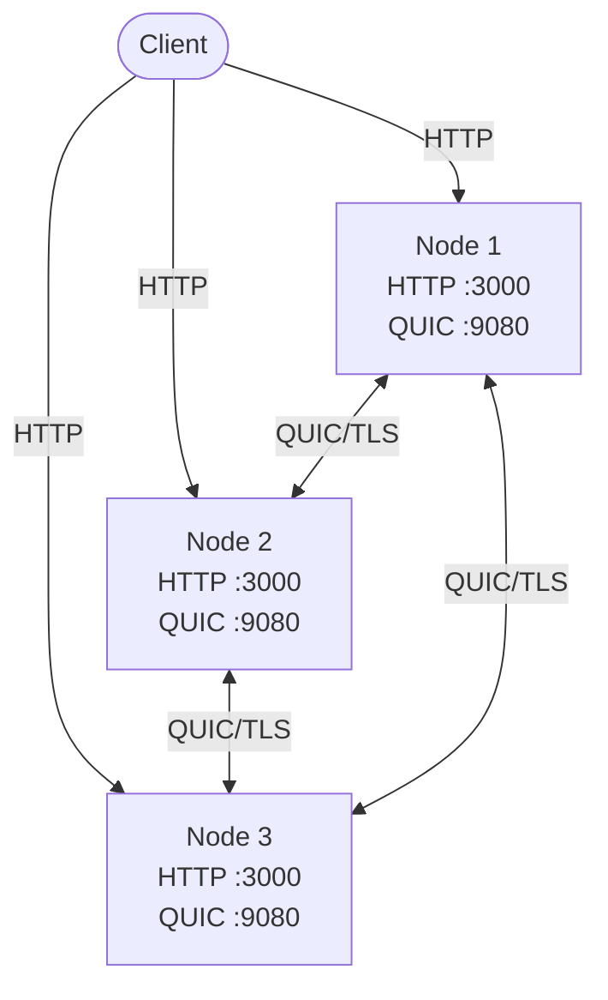

# Clustering & Federation

Prism supports distributed clustering where multiple nodes form a cluster, sharing search load across all members. Documents indexed on one node are searchable from any other node via federated queries over QUIC.

## Architecture



Each node runs two servers:

- **HTTP API** (default `:3000`) — Serves regular and federated search/index requests
- **QUIC RPC** (default `:9080/udp`) — Inter-node communication over TLS

When a federated query arrives, the node fans out the query to all shards across the cluster via QUIC, merges results by score, and returns the combined response.

## Build with Cluster Support

Clustering is behind a feature flag:

```bash
cargo build -p prism-server --release --features cluster
```

Or with all features:

```bash
cargo build -p prism-server --release --features "full,ui,es-compat,cluster"
```

## Configuration

Each node needs a `prism.toml` with a `[cluster]` section:

```toml
[server]
bind_addr = "0.0.0.0:3000"

[storage]
data_dir = "/data"

[cluster]
enabled = true
node_id = "node-1"
bind_addr = "0.0.0.0:9080"
advertise_addr = "prism-node1:9080"
seed_nodes = ["prism-node2:9080", "prism-node3:9080"]
connect_timeout_ms = 5000
request_timeout_ms = 30000

[cluster.tls]
enabled = true
cert_path = "/conf/tls/node-cert.pem"
key_path = "/conf/tls/node-key.pem"
ca_cert_path = "/conf/tls/ca-cert.pem"
skip_verify = false
```

### Cluster Settings

| Option | Default | Description |
|--------|---------|-------------|
| `enabled` | `false` | Enable cluster mode |
| `node_id` | random UUID | Unique identifier for this node |
| `bind_addr` | `0.0.0.0:9080` | QUIC RPC bind address (UDP) |
| `advertise_addr` | same as `bind_addr` | Address other nodes use to reach this node. **Required** when `bind_addr` is `0.0.0.0` |
| `seed_nodes` | `[]` | List of other nodes to form the cluster with |
| `connect_timeout_ms` | `5000` | Timeout for QUIC connection handshake |
| `request_timeout_ms` | `30000` | Timeout for individual RPC requests |
| `max_connections` | `10` | Max concurrent QUIC connections per node |

### TLS Settings

QUIC requires TLS. All inter-node communication is encrypted.

| Option | Default | Description |
|--------|---------|-------------|
| `tls.enabled` | `true` | Enable TLS (strongly recommended) |
| `tls.cert_path` | `./conf/tls/cluster-cert.pem` | Node certificate (PEM) |
| `tls.key_path` | `./conf/tls/cluster-key.pem` | Node private key (PEM) |
| `tls.ca_cert_path` | — | CA certificate for peer verification |
| `tls.skip_verify` | `false` | Skip peer verification (dev only) |

!!! warning
    Setting `skip_verify = true` disables TLS peer verification. Only use this for local development.

## TLS Certificate Setup

Generate a self-signed CA and node certificates for testing:

```bash
#!/usr/bin/env bash
set -euo pipefail
TLS_DIR="./conf/tls"
mkdir -p "$TLS_DIR"

# Generate CA
openssl req -x509 -newkey rsa:2048 -nodes \
    -keyout "$TLS_DIR/ca-key.pem" \
    -out "$TLS_DIR/ca-cert.pem" \
    -days 365 -subj "/CN=prism-cluster-ca"

# Generate node key
openssl genrsa -out "$TLS_DIR/node-key.pem" 2048

# Create SAN config (list all node hostnames)
cat > "$TLS_DIR/san.cnf" <<EOF
[req]
distinguished_name = req_dn
req_extensions = v3_req
prompt = no
[req_dn]
CN = prism-cluster
[v3_req]
subjectAltName = @alt_names
[alt_names]
DNS.1 = prism-node1
DNS.2 = prism-node2
DNS.3 = prism-node3
DNS.4 = localhost
IP.1 = 127.0.0.1
EOF

# Generate CSR and sign with CA
openssl req -new -key "$TLS_DIR/node-key.pem" \
    -out "$TLS_DIR/node.csr" -config "$TLS_DIR/san.cnf"

openssl x509 -req -in "$TLS_DIR/node.csr" \
    -CA "$TLS_DIR/ca-cert.pem" -CAkey "$TLS_DIR/ca-key.pem" \
    -CAcreateserial -out "$TLS_DIR/node-cert.pem" \
    -days 365 -extensions v3_req -extfile "$TLS_DIR/san.cnf"

rm -f "$TLS_DIR/node.csr" "$TLS_DIR/ca-cert.srl" "$TLS_DIR/san.cnf"
```

!!! tip
    The SAN (Subject Alternative Name) entries must include every hostname used in `advertise_addr` and `seed_nodes`. QUIC uses SNI to verify the server name matches the certificate.

## Federated API

When clustering is enabled, additional endpoints become available:

### Federated Search

```
POST /cluster/collections/{collection}/search
```

Fans out the query to all shards in the cluster and merges results by score.

**Request:**

```json
{
  "query": "distributed search",
  "limit": 10
}
```

**Response:**

```json
{
  "results": [
    {
      "id": "doc1",
      "score": 1.756,
      "fields": { "title": "distributed search engine", "body": "..." }
    }
  ],
  "total": 3,
  "latency_ms": 46,
  "is_partial": false,
  "shard_status": {
    "total": 3,
    "successful": 3,
    "failed": 0
  }
}
```

| Field | Description |
|-------|-------------|
| `is_partial` | `true` if some shards failed but results are still returned |
| `shard_status.total` | Total number of shards queried |
| `shard_status.successful` | Shards that responded successfully |
| `shard_status.failed` | Shards that failed (timeouts, errors) |

### Federated Index

```
POST /cluster/collections/{collection}/documents
```

Routes documents to the correct shard based on document ID hash.

**Request:**

```json
{
  "documents": [
    { "id": "doc1", "fields": { "title": "hello", "body": "world" } }
  ]
}
```

**Response:**

```json
{
  "total_docs": 1,
  "successful_docs": 1,
  "failed_docs": 0,
  "latency_ms": 32
}
```

### Cluster Health

```
GET /cluster/health
```

Returns basic cluster status.

## Docker Compose Example

A complete 3-node cluster using Docker Compose:

```yaml
services:
  prism-node1:
    build:
      context: .
      args:
        FEATURES: cluster
    hostname: prism-node1
    command: ["--host", "0.0.0.0", "--port", "3000", "--schemas-dir", "/schemas"]
    volumes:
      - ./node1.toml:/data/prism.toml:ro
      - ./schemas:/schemas:ro
      - ./conf/tls:/conf/tls:ro
    ports:
      - "3081:3000"
      - "9081:9080/udp"
    networks:
      - cluster-net

  prism-node2:
    build:
      context: .
      args:
        FEATURES: cluster
    hostname: prism-node2
    command: ["--host", "0.0.0.0", "--port", "3000", "--schemas-dir", "/schemas"]
    volumes:
      - ./node2.toml:/data/prism.toml:ro
      - ./schemas:/schemas:ro
      - ./conf/tls:/conf/tls:ro
    ports:
      - "3082:3000"
      - "9082:9080/udp"
    networks:
      - cluster-net

  prism-node3:
    build:
      context: .
      args:
        FEATURES: cluster
    hostname: prism-node3
    command: ["--host", "0.0.0.0", "--port", "3000", "--schemas-dir", "/schemas"]
    volumes:
      - ./node3.toml:/data/prism.toml:ro
      - ./schemas:/schemas:ro
      - ./conf/tls:/conf/tls:ro
    ports:
      - "3083:3000"
      - "9083:9080/udp"
    networks:
      - cluster-net

networks:
  cluster-net:
    driver: bridge
```

Each node gets its own `nodeN.toml` with a unique `node_id` and the other two nodes listed as `seed_nodes`.

## Quick Start

```bash
# 1. Generate TLS certificates
./generate-certs.sh

# 2. Start the cluster
docker compose up --build -d

# 3. Index documents on node 1
curl -X POST http://localhost:3081/collections/docs/documents \
  -H 'Content-Type: application/json' \
  -d '{"documents": [
    {"id": "doc1", "fields": {"title": "hello world"}}
  ]}'

# 4. Federated search from node 3 (finds docs from node 1)
curl -X POST http://localhost:3083/cluster/collections/docs/search \
  -H 'Content-Type: application/json' \
  -d '{"query": "hello"}'

# 5. Tear down
docker compose down -v
```

## How It Works

1. **Shard assignment** — Each collection is split into shards (1 per node by default). Shards are assigned to nodes at startup.

2. **Federated search** — A query hits any node's `/cluster/collections/{name}/search` endpoint. That node fans out the query to all shards via QUIC RPC, each shard searches its local index, and results are merged by score.

3. **Federated index** — Documents sent to `/cluster/collections/{name}/documents` are routed to the correct shard based on `hash(doc_id) % num_shards`. The target node indexes the document locally.

4. **Transport** — Inter-node communication uses [QUIC](https://en.wikipedia.org/wiki/QUIC) (UDP-based, TLS-encrypted) with [tarpc](https://github.com/google/tarpc) for RPC. QUIC connections are pooled; each RPC call opens a fresh bidirectional stream (cheap in QUIC).

5. **Partial results** — If some shards fail, the cluster returns partial results with `is_partial: true` and details in `shard_status`. This is configurable via the federation config.

## See Also

- [Configuration](../admin/configuration.md) — Full config reference
- [Deployment](../admin/deployment.md) — Docker and production setup
- [Vector Search](vector-search.md) — HNSW vector search with sharding
