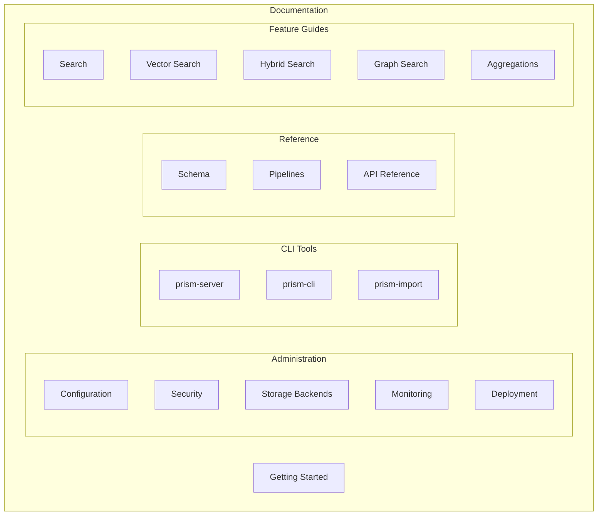

# Prism Documentation

Prism is a high-performance hybrid search engine combining vector search (HNSW) with full-text search (Tantivy) for AI/RAG applications.

## Documentation Structure



## Quick Links

### Getting Started

- [**Getting Started**](guides/getting-started.md) — Installation, first collection, basic search

### Administration

- [Configuration](admin/configuration.md) — Server and storage configuration
- [Security](admin/security.md) — API keys, RBAC, audit logging
- [Storage Backends](admin/storage-backends.md) — Local, S3, MinIO, caching
- [Monitoring](admin/monitoring.md) — Prometheus metrics, logging
- [Deployment](admin/deployment.md) — Docker, Kubernetes, production setup

### CLI Reference

- [prism-server](cli/prism-server.md) — HTTP server
- [prism-cli](cli/prism-cli.md) — Collection and document management
- [prism-import](cli/prism-import.md) — Import from Elasticsearch

### Reference

- [Collection Schema](reference/schema.md) — Field types, backends, boosting
- [Ingest Pipelines](reference/pipelines.md) — Document processing
- [API Reference](reference/api-reference.md) — REST API endpoints

### Feature Guides

- [Search](guides/search.md) — Query syntax, filtering, pagination
- [Vector Search](guides/vector-search.md) — Embeddings, HNSW configuration
- [Hybrid Search](guides/hybrid-search.md) — Combining text and vector
- [Graph Search](guides/graph-search.md) — Nodes, edges, BFS, shortest-path
- [Aggregations](guides/aggregations.md) — Metrics, histograms, facets
- [Highlighting](guides/highlighting.md) — Search result snippets
- [Suggestions](guides/suggestions.md) — Autocomplete
- [More Like This](guides/more-like-this.md) — Similar documents
- [Ranking](guides/ranking.md) — Boosting, field weights, signals
- [Web UI](guides/web-ui.md) — Embedded search interface
- [Encryption](guides/encryption.md) — AES-256-GCM encryption at rest
- [Export/Import](guides/export-import.md) — Backup and restore

## Quick Start

```bash
# 1. Start server
prism-server

# 2. Create schema (schemas/docs.yaml)
cat > ~/.prism/schemas/docs.yaml << 'EOF'
collection: docs
backends:
  text:
    fields:
      - name: title
        type: text
      - name: content
        type: text
EOF

# 3. Index documents
curl -X POST http://localhost:3080/collections/docs/documents \
  -H "Content-Type: application/json" \
  -d '[{"id": "1", "title": "Hello", "content": "World"}]'

# 4. Search
curl -X POST http://localhost:3080/collections/docs/search \
  -H "Content-Type: application/json" \
  -d '{"query": "hello"}'
```

## Version

This documentation covers Prism v0.5.0.
